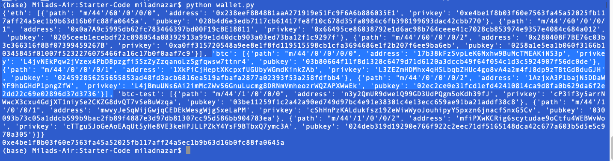
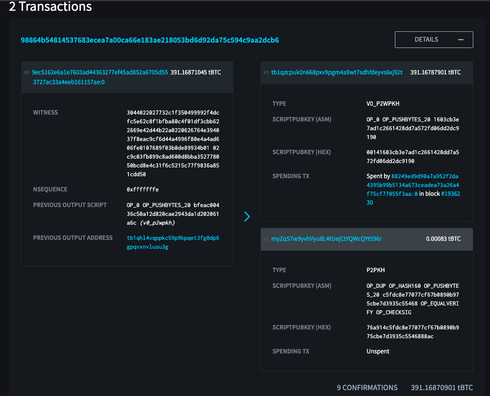

# Multi-Blockchain Wallet in Python
I'm using my Python skills to generate a HD Wallet that includes btc, eth and bitcoin testnet all in one place. First of all, I start downloading and installing the required dependencies such as the following:
- PHP 
- hd-wallet-derive 
- bit 
- web3.py

### Deriving the wallet keys

**Now I'm able to write my functions to build the multi-coin wallet consisting of btc, eth and bitcoin testnet. I did this mostly in Visual Studio and Terminal and I was able to print out the details of each coin in my wallet. I created 3 functions seperately for btc-testnet, and eth.**
print()
*Here is a screenshot of my hd wallet which all sorts of info for btc, eth, and btctest.*
  

### Send some transactions!
#### Bitcoin Testnet transaction
Here is the copy of sending btc-test transactions for 0.00008. According to the balance available. I can rerun my python code and transfer coins to any btc or eth addresses. 

#### Local PoA Ethereum transaction

### Submission

### Challenge Mode

